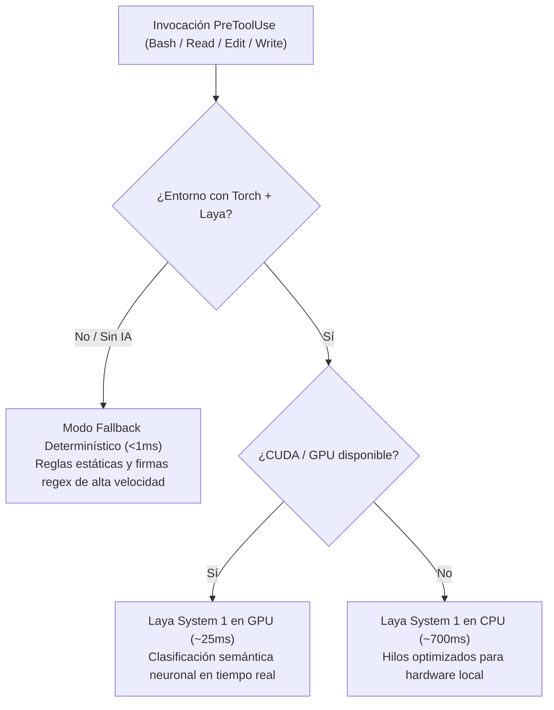

# ⚡ Synapse: Real-Time Security Guardrails for Claude Code

> Guardrails de seguridad y control de ejecución en tiempo real para Claude Code mediante interceptores `PreToolUse`. Potenciado por clasificación neuronal **Laya System 1** con aceleración GPU/CPU y degradación elegante a reglas determinísticas de latencia cero (<1ms).

[](LICENSE)
[](https://docs.anthropic.com/en/docs/claude-code)
[](#-arquitectura-y-modos-de-cómputo)
[](#-suite-de-pruebas)

---

## 🎯 ¿Por qué Synapse?

Durante sesiones de desarrollo asistido con agentes autónomos como Claude Code, surgen fricciones críticas de seguridad y productividad:
1. **Fricción por permisos en temporales**: Claude solicita confirmación manual constante para eliminar archivos efímeros en `./tmp/**`, retrasando flujos automatizados.
2. **Exfiltración de credenciales**: Intentos inadvertidos de leer archivos `.env` completos con `cat` o `Read`, volcando tokens privados en la ventana de contexto del LLM.
3. **Escritura accidental de secretos**: Inserción inadvertida de claves API reales (`sk-*`, `AKIA*`, tokens JWT) en archivos de código o commits.
4. **Corrupción de dependencias**: Modificación no intencionada de lockfiles (`uv.lock`, `package-lock.json`) o directorios del sistema de control de versiones (`.git/`).

**Synapse** resuelve estos riesgos interceptando las herramientas nativas de Claude Code (`Bash`, `Read`, `Edit`, `Write`) antes de que se ejecuten.

---

## 🛡️ Políticas y Guardrails Activos

| Hook Interceptor | Herramienta | Política Aplicada | Comportamiento |
| :--- | :--- | :--- | :--- |
| **`block_dangerous.py`** | `Bash` | **Auto-aprobación de temporales** | Permite incondicionalmente (`allow`) manipular `./tmp/**`, `/tmp/claude-*`, artefactos de build (`dist`, `build`, `__pycache__`) y archivos en `.gitignore`. |
| | `Bash` | **Comandos catastróficos** | Bloquea inmediatamente (`exit 2`) comandos destructivos (`rm -rf /`, fork bombs, `mkfs`, `dd`, `git push --force` a `main`/`master`). |
| | `Bash` | **Borrado no temporal** | Solicita confirmación interactiva al usuario (`ask`) para eliminar archivos de código permanentes. |
| **`block_env_read.py`** | `Bash`, `Read` | **Protección de `.env`** | Bloquea lectura directa (`cat`, `head`, `tail`, `awk`, `grep`). Sugiere usar `set -a; source .env; set +a`. Expone las keys detectadas con tipos inferidos (`<URL>`, `<booleano>`) sin valores reales. Permite `.env.example`. |
| **`detect_secrets.py`** | `Edit`, `Write` | **Filtro de credenciales** | Bloquea inserción de claves OpenAI (`sk-*`), AWS (`AKIA*`), GitHub (`ghp_*`), JWT y contraseñas. Admite placeholders seguros (`REPLACE_ME`, `os.environ.get`). |
| **`protect_files.py`** | `Edit`, `Write` | **Integridad de repositorio** | Bloquea modificaciones a `.git/`, `.venv/`, `.env` y lockfiles (`uv.lock`, `package-lock.json`, `bun.lock`). Requiere confirmación (`ask`) para alterar `.claude/settings.json` o hooks. |

---

## ⚡ Arquitectura y Modos de Cómputo

Synapse opera bajo una política de **degradación elegante automática**:



- **Modo Fallback (<1ms)**: Funciona con Python estándar sin ninguna dependencia externa instalada.
- **Modo GPU (~25ms)**: Activa la red neuronal Laya System 1 sobre aceleradores NVIDIA CUDA.
- **Modo CPU (~700ms)**: Evalúa inferencias semánticas limitando hilos a núcleos físicos para evitar contención.

---

## 📋 Registro y Auditoría Persistente

Todas las decisiones tomadas por los guardrails de Synapse se registran sincrónicamente en:
1. `~/.claude/logs/security_hooks.log` (Auditoría global del sistema).
2. `./logs/security_hooks.log` (Auditoría local del repositorio).

### Formato de Registro
```text
[2026-10-01 23:35:45] [ALLOW  ] [LAYA-CUDA  ] [block_dangerous  ] Tool: Bash  | Target: 'rm -f ./tmp/cache.log' | Reason: Target is within project temporary directory (./tmp/)
[2026-10-01 23:35:46] [BLOCKED] [LAYA-CUDA  ] [block_env_read   ] Tool: Bash  | Target: 'cat .env'              | Reason: Direct read of environment file (.env) is blocked
[2026-10-01 23:35:47] [BLOCKED] [FALLBACK   ] [detect_secrets   ] Tool: Edit  | Target: '(none)'                | Reason: Detected high-confidence secret: OpenAI API Key format
[2026-10-01 23:35:48] [ASK    ] [FALLBACK   ] [protect_files    ] Tool: Edit  | Target: '.claude/settings.json' | Reason: Configuration file requires confirmation
```

---

## 🚀 Instalación y Activación

### Opción 1: Desde el catálogo oficial de plugins de bypabloc
```bash
claude plugin marketplace add bypabloc/claude-plugins
claude plugin add synapse
```

### Opción 2: Instalación directa desde GitHub
```bash
claude plugin add bypabloc/claude-plugin-synapse
```

### Opción 3: Vinculación local para desarrollo
```bash
claude --plugin-dir /ruta/a/claude-plugin-synapse
```

---

## 🧪 Suite de Pruebas

Synapse incluye 32 pruebas automatizadas que cubren la totalidad de casos de uso y edge cases:

```bash
# Validar estructura y manifiesto del plugin
python tests/test_manifest.py

# Validar integridad estricta con el validador oficial de Claude Code
claude plugin validate . --strict

# Ejecutar suite de 32 pruebas en modo GPU
python tests/test_hooks.py --gpu

# Ejecutar suite de 32 pruebas en modo CPU
python tests/test_hooks.py --cpu

# Ejecutar suite de 32 pruebas en modo Fallback determinístico (5.8 ms)
python tests/test_hooks.py --fallback
```

---

## 🛠️ Estructura del Proyecto

```text
claude-plugin-synapse/
├── .claude-plugin/
│   └── plugin.json                  # Manifiesto de Claude Code Plugin
├── marketplace-entry.json           # Entrada para registro en marketplace monorepo
├── hooks/
│   ├── hooks.json                   # Configuración declarativa de PreToolUse
│   ├── common.py                    # Núcleo compartido, logs, fallback y Laya router
│   ├── block_dangerous.py           # Auto-aprobación de ./tmp y bloqueo catastrófico
│   ├── block_env_read.py            # Protección .env e inferencia de formatos
│   ├── detect_secrets.py            # Detección regex y semántica de credenciales
│   └── protect_files.py             # Protección de lockfiles y configs críticas
├── rules/
│   └── security-guardrails.md       # Directrices de seguridad inyectables
├── skills/
│   └── synapse-status/
│       └── SKILL.md                 # Skill interactivo de estado de guardrails
├── commands/
│   └── synapse-status.md            # Comando /synapse:synapse-status
├── tests/
│   ├── test_manifest.py             # Validación de manifiesto y permisos
│   └── test_hooks.py                # Suite de 32 pruebas en GPU, CPU y Fallback
├── logs/
│   └── .gitkeep                     # Directorio de logs locales (git-ignored)
├── .gitignore                       # Ignora temporales, caches y logs
├── LICENSE                          # Licencia MIT
└── README.md                        # Documentación técnica
```

---

## 👤 Autor

**Pablo Contreras (bypabloc)**
- GitHub: [@bypabloc](https://github.com/bypabloc)
- Correo: pacg1991@gmail.com

---

## 📄 Licencia

Este proyecto está bajo la Licencia [MIT](LICENSE).
