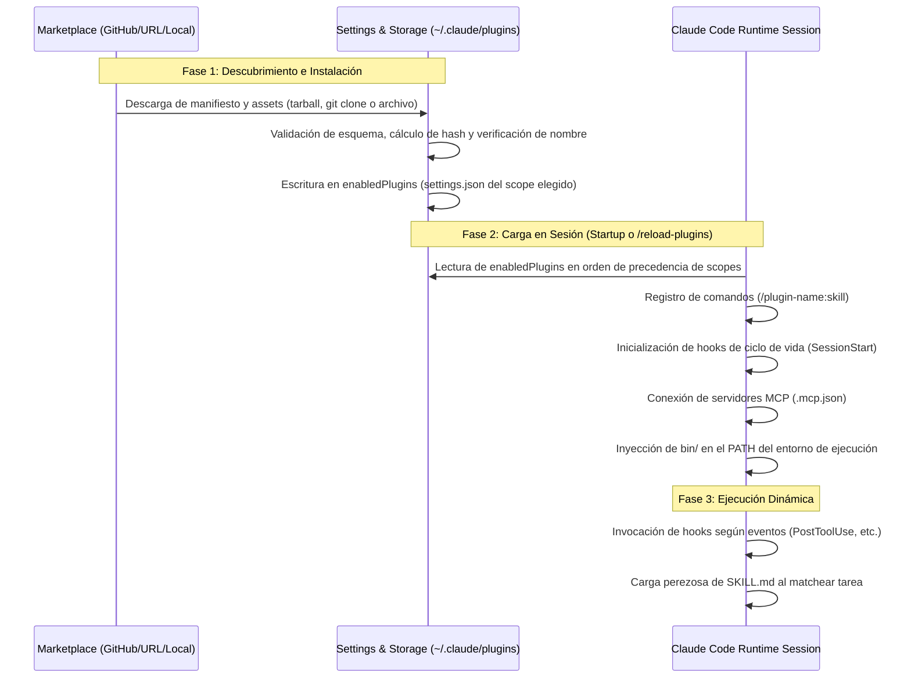

# Panorama General y Arquitectura de Plugins en Claude Code

> Documento de investigación técnica exhaustiva sobre el ecosistema, ciclo de vida, modelos de aislamiento y arquitectura interna de plugins en Claude Code (Anthropic).

---

## 1. Modelo Conceptual: ¿Qué es un Plugin de Claude Code?

Un **plugin de Claude Code** es una unidad modular, versionable e instalable que empaqueta capacidades y comportamientos reutilizables para el asistente de desarrollo. En lugar de dispersar scripts, servidores MCP y reglas de prompts en configuraciones locales no versionadas, un plugin agrupa estos artefactos bajo un único directorio con un manifiesto estandarizado.

```
+-----------------------------------------------------------------------------------+
|                                Claude Code Plugin                                 |
+-----------------------------------------------------------------------------------+
|  [Manifest]            .claude-plugin/plugin.json                                 |
|  [Skills]              skills/<name>/SKILL.md  --> /plugin-name:skill             |
|  [Subagents]           agents/<name>.md        --> @agent-plugin-name:name        |
|  [Hooks]               hooks/hooks.json        --> Ciclo de vida (Session, Tool)   |
|  [MCP Servers]         .mcp.json               --> Herramientas de protocolo MCP  |
|  [LSP Servers]         .lsp.json               --> Language Server Protocol       |
|  [Executables]         bin/                    --> Herramientas en $PATH de Bash  |
|  [Background Tasks]    monitors/monitors.json  --> Monitoreo en segundo plano     |
|  [UI Customization]    output-styles/, themes/ --> Estilo de salida y colores     |
|  [Workflows]           workflows/*.js          --> Orquestación multi-agente      |
+-----------------------------------------------------------------------------------+
```

### Diferencia: `.claude/` Standalone vs. Plugins

| Dimensión | Configuración Standalone (`.claude/` o `~/.claude/`) | Plugin de Claude Code |
| :--- | :--- | :--- |
| **Ámbito (Scope)** | Aislado a un repositorio o a un usuario específico. | Distribuible entre múltiples proyectos, equipos y organizaciones. |
| **Versionado** | Depende del repositorio anfitrión o no tiene versionado. | Semantic Versioning (`version: "1.0.0"`), pinning por commit/tag. |
| **Colisiones de Nombres** | Alto riesgo de colisión entre comandos locales y globales. | Namespacing estricto y automático: `/<plugin-name>:<command>`. |
| **Dependencias y Datos** | Configuración manual de dependencias de sistema/Node. | Directorio persistente `${CLAUDE_PLUGIN_DATA}` gestionado por el runtime. |
| **Configuración de Usuario** | Edición manual de archivos `settings.json`. | Declaración declarativa con `userConfig` (GUI/CLI interactivo). |
| **Canales de Distribución** | Copiar/pegar archivos entre proyectos. | Marketplaces Git, npm, URLs directas, archivos ZIP y catálogo oficial. |

> [!NOTE] Proyectos de Referencia en Producción
> Esta investigación toma como casos prácticos directos los proyectos del usuario:
> - [`~/projects/bypabloc/claude-plugins`](file:///home/bypabloc/projects/bypabloc/claude-plugins): Estructura Monorepo Hub con empaquetado multi-plugin y `marketplace.json`.
> - [`~/projects/bypabloc/claude-plugin-spanish-latam`](file:///home/bypabloc/projects/bypabloc/claude-plugin-spanish-latam): Implementación de inyección dual (`SessionStart` + `UserPromptSubmit`) para control de dialecto y calidad.
> 
> Análisis detallado en [`06-analisis-casos-reales-y-proyectos-bypabloc.md`](file:///home/bypabloc/projects/bypabloc/laya/docs/research/claude_plugins/06-analisis-casos-reales-y-proyectos-bypabloc.md).

---

## 2. Impacto en la Sesión y Huella de Contexto (Context Footprint)

Un plugin habilitado está presente en **todas** las sesiones activas, incluso en aquellas donde el usuario no invoca explícitamente sus componentes. Esto introduce implicaciones técnicas críticas:

1. **Consumo de Context Window en Cada Turno:**
   - Los metadatos (`name` y `description`) de cada skill, subagente y comando se inyectan en el system prompt de Claude en cada turno para que el modelo sepa que existen.
   - El contenido completo de las instrucciones (`SKILL.md` o `agents/*.md`) **no** se carga al inicio; se carga bajo demanda únicamente cuando el modelo decide invocarlo o el usuario lo ejecuta.
   - **Regla de optimización:** Si un skill solo debe ser ejecutado por humanos y nunca por el LLM, debe marcarse con `disable-model-invocation: true` en el frontmatter para no saturar el prompt del sistema.

2. **Procesos en Segundo Plano:**
   - Los servidores MCP locales declarados en `.mcp.json` se inicializan junto con la sesión y mantienen procesos persistentes en background.
   - Los monitores declarados en `monitors/monitors.json` corren en background consumiendo recursos del host.

3. **Privilegios de Ejecución:**
   - Cualquier script invocado por un hook o binario dentro del plugin se ejecuta con los privilegios completos del usuario del sistema operativo.

---

## 3. Niveles de Alcance de Instalación (Install Scopes)

Al instalar un plugin mediante CLI o `/plugin`, se define el alcance donde se registrará en las configuraciones:

```
                            Prioridad de Carga (Menor a Mayor)
+-----------------------------------------------------------------------------------------+
| [1. Plugin Defaults]  settings.json interno del plugin (agent, subagentStatusLine)       |
| [2. User Scope]       ~/.claude/settings.json (Afecta a todos los proyectos del dev)   |
| [3. Project Scope]    <repo>/.claude/settings.json (Versionado en Git para el equipo)   |
| [4. Local Scope]      <repo>/.claude/settings.local.json (Ignorado en .gitignore)       |
| [5. Managed Scope]    Políticas corporativas impuestas por MDM/Administración           |
| [6. Inline/Session]   --plugin-dir / --plugin-url (Solo la sesión en ejecución)         |
+-----------------------------------------------------------------------------------------+
```

- **`user` (Predeterminado):**
  - Escribe en `~/.claude/settings.json`.
  - El plugin está disponible en cualquier sesión de terminal, VS Code o Claude Desktop en esa máquina.
- **`project`:**
  - Escribe en `<project>/.claude/settings.json`.
  - Diseñado para versionarse en Git. Los colaboradores reciben la activación del plugin automáticamente al clonar el proyecto, requiriendo únicamente ejecutar la instalación local si proviene de un marketplace no integrado.
- **`local`:**
  - Escribe en `<project>/.claude/settings.local.json`.
  - Habilitado solo para el desarrollador en ese repositorio en particular; no se commitea.
- **`managed`:**
  - Configurado a nivel corporativo por administradores mediante archivos del sistema operativo o variables de entorno. Puede bloquear o forzar la instalación obligatoria de ciertos plugins.

---

## 4. Ciclo de Vida: De Marketplaces al Runtime

El ciclo de resolución y ejecución de un plugin sigue un proceso determinista de tres fases:



### Capas del Estado de un Plugin

1. **Capa de Ajustes (`settings.json`):** Contiene el catálogo de marketplaces registrados (`extraKnownMarketplaces`) y el diccionario de plugins activados (`enabledPlugins`).
2. **Capa de Almacenamiento en Disco:** Los plugins descargados residen en `~/.claude/plugins/cache/`. Los datos persistentes que sobreviven a actualizaciones residen en `~/.claude/plugins/data/<plugin-id>/`.
3. **Capa de Memoria de Sesión:** Carga inicial al arrancar el proceso `claude`, o actualización en caliente mediante el comando `/reload-plugins`.

---

## 5. Clasificación y Tiers de Marketplaces

Los plugins se distribuyen mediante repositorios o directorios denominados **marketplaces** (catálogos de metadatos):

1. **Official Tier (`claude-plugins-official`):**
   - Catálogo administrado directamente por Anthropic.
   - Disponible por defecto en cualquier instalación estándar de Claude Code.
   - Muestra estimaciones auditadas de costo de tokens y pasa por revisiones de seguridad.
2. **Community Tier (`claude-community`, `claude-plugins-community`):**
   - Plugins desarrollados por la comunidad y alojados bajo la organización `github.com/anthropics/`.
3. **Third-Party Tier (Marketplaces Propios / Organizacionales):**
   - Cualquier repositorio GitHub o servidor web privado con un archivo `.claude-plugin/marketplace.json`.
   - Permite a empresas o desarrolladores independientes crear su propia tienda privada interna (ej. el marketplace `bypabloc` del usuario).
