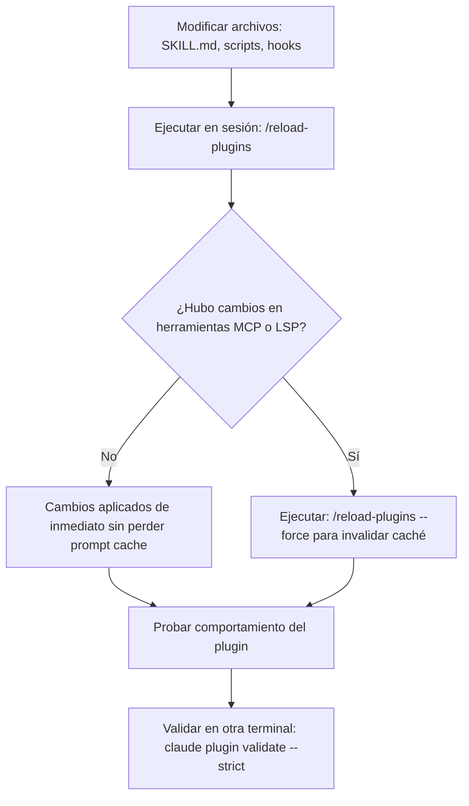

# Guía Paso a Paso: Creación, Migración y Desarrollo Local de Plugins

> Guía práctica y metodológica para concebir, estructurar, probar en local e iterar plugins de Claude Code sin depender de un marketplace publicado.

---

## 1. Creación de un Plugin desde Cero (Walkthrough)

A continuación se detalla el procedimiento para construir un plugin funcional con un skill y validarlo en el entorno de desarrollo.

### Paso 1: Inicialización de la Estructura

Crear la carpeta raíz del plugin y el subdirectorio reservado `.claude-plugin/`:

```bash
mkdir -p dev-assistant/.claude-plugin
mkdir -p dev-assistant/skills/pr-summary
```

### Paso 2: Creación del Manifiesto `plugin.json`

Crear el archivo `dev-assistant/.claude-plugin/plugin.json`:

```json
{
  "name": "dev-assistant",
  "version": "1.0.0",
  "description": "Herramientas de productividad y resumen para pull requests",
  "author": {
    "name": "Pablo Contreras",
    "email": "pacg1991@gmail.com"
  }
}
```

### Paso 3: Definición del Skill

Crear el archivo `dev-assistant/skills/pr-summary/SKILL.md`:

```markdown
---
name: pr-summary
description: Genera un resumen ejecutivo de los cambios preparados en Git para un PR.
disable-model-invocation: true
---

Revisa las diferencias preparadas en el repositorio Git mediante `git diff --cached` (o `git diff HEAD~1` si ya hay commits locales). 

Genera un resumen estructurado que incluya:
1. **Objetivo Principal:** Una oración clara del propósito del cambio.
2. **Cambios Clave:** Lista con viñetas técnicas de archivos modificados y decisiones tomadas.
3. **Plan de Pruebas:** Comandos de verificación ejecutados y resultados esperados.
```

### Paso 4: Validación Estricta

Antes de cargar el plugin en una sesión interactiva, ejecutar el validador oficial:

```bash
claude plugin validate ./dev-assistant --strict
```

Salida esperada:
```text
✔ Checking plugin manifest: ./dev-assistant/.claude-plugin/plugin.json
✔ Checking skills: 1 found
✔ Validation passed
```

### Paso 5: Prueba de Carga en Sesión Única

Iniciar Claude Code inyectando el plugin mediante `--plugin-dir`:

```bash
claude --plugin-dir ./dev-assistant
```

Dentro de la sesión de Claude Code, invocar el comando registrado con su prefijo:

```text
/dev-assistant:pr-summary
```

---

## 2. Desarrollo Local sin Marketplace (Estrategias de Carga)

No es necesario registrar ni publicar un marketplace para desarrollar plugins. Claude Code ofrece cuatro mecanismos nativos para el desarrollo local:

### 1. Inyección de Directorio Único (`--plugin-dir`)

Carga un directorio local o un archivo ZIP para la sesión en curso. La sesión no altera archivos de configuración global.

```bash
claude --plugin-dir /ruta/absoluta/a/dev-assistant
```

Se pueden concatenar múltiples plugins en una misma llamada:

```bash
claude --plugin-dir ./plugin-auth --plugin-dir ./plugin-database
```

### 2. Carga de un Monorepo de Plugins (`Folder of Plugins`)

Si pasas un directorio que contiene múltiples subdirectorios (donde cada uno tiene su propio `.claude-plugin/plugin.json`), Claude Code detecta automáticamente la estructura monorepo y carga todos los plugins hijos en paralelo:

```bash
# Si ~/projects/bypabloc/claude-plugins/plugins/ contiene varios plugins:
claude --plugin-dir ~/projects/bypabloc/claude-plugins/plugins
```

> [!NOTE]
> Requiere Claude Code v2.1.265 o superior. Además, en sesiones interactivas, si agregas una nueva subcarpeta con manifiesto dentro de esa carpeta mientras la sesión está abierta, Claude Code la detectará en caliente.

### 3. Carga desde Variable de Entorno (`CLAUDE_CODE_PLUGIN_DIRS`)

Útil para entornos CI/CD, scripts de inicio de terminal o integraciones IDE donde no se pueden pasar flags directos a la CLI:

```bash
export CLAUDE_CODE_PLUGIN_DIRS="/home/usuario/plugins/dev-tools:/home/usuario/plugins/fintech-rules"
claude
```

### 4. Inicialización Automática Global (`claude plugin init`)

Si deseas que un plugin esté disponible siempre en tu máquina sin configurar parámetros de inicio:

```bash
claude plugin init mi-herramienta --with skills hooks
```

Este comando:
1. Crea el scaffolding en `~/.claude/skills/mi-herramienta/`.
2. Genera `.claude-plugin/plugin.json`.
3. Se auto-carga en todas las sesiones bajo el identificador `mi-herramienta@skills-dir`.

---

## 3. Flujo de Iteración Rápida: Edit-Reload-Validate

Cuando desarrollas un plugin, no es necesario reiniciar el proceso `claude` cada vez que modificas un archivo:



### Comandos de Diagnóstico en Sesión Activa

- `/reload-plugins`: Recarga la definición de skills, subagentes, reglas y hooks. Muestra el resumen de componentes recargados.
- `/reload-plugins --force`: Fuerza la recarga cuando se agregaron o eliminaron servidores MCP/LSP (lo que requiere reconstruir las herramientas expuestas).
- `/plugin`: Abre el panel interactivo con pestañas:
  - **Installed:** Muestra el plugin cargado y sus componentes reconocidos.
  - **Errors:** Si un archivo falló al cargar (ej. ruta inexistente o JSON malformado), muestra la traza exacta.

---

## 4. Migración de un Directorio `.claude/` Existente a Plugin

Si ya tienes un repositorio con comandos, subagentes o hooks en `.claude/`, migrarlos a un plugin autónomo toma menos de 5 minutos:

### Paso 1: Copiar Componentes al Nuevo Directorio

```bash
# 1. Crear el nuevo plugin
mkdir -p nuevo-plugin/.claude-plugin

# 2. Copiar los recursos existentes
cp -r .claude/skills nuevo-plugin/ 2>/dev/null || true
cp -r .claude/commands nuevo-plugin/ 2>/dev/null || true
cp -r .claude/agents nuevo-plugin/ 2>/dev/null || true

# 3. Si tienes un script de hooks en el proyecto, copiarlo
mkdir -p nuevo-plugin/scripts
cp -r .claude/scripts/* nuevo-plugin/scripts/ 2>/dev/null || true
```

### Paso 2: Crear el Manifiesto Base

Crear `nuevo-plugin/.claude-plugin/plugin.json`:

```json
{
  "name": "repo-tools",
  "version": "1.0.0",
  "description": "Herramientas migradas de la configuración local .claude/"
}
```

### Paso 3: Migrar Hooks desde `settings.json`

Si tenías hooks definidos dentro de `.claude/settings.json`, cópialos a `nuevo-plugin/hooks/hooks.json`. La estructura del objeto interno es 100% idéntica:

```json
{
  "hooks": {
    "PostToolUse": [
      {
        "matcher": "Write|Edit",
        "hooks": [
          {
            "type": "command",
            "command": "\"${CLAUDE_PLUGIN_ROOT}/scripts/lint.sh\""
          }
        ]
      }
    ]
  }
}
```

### Paso 4: Ajustar Nombres e Invocaciones

- Los skills que antes ejecutabas como `/mi-skill` ahora se invocan como `/repo-tools:mi-skill`.
- Los subagentes que antes invocabas como `@agent-auditor` ahora se invocan como `@agent-repo-tools:auditor`.
- Una vez verificado el plugin con `--plugin-dir ./nuevo-plugin`, elimina los originales de `.claude/` para evitar que se ejecuten duplicados.

---

## 5. El Plugin Oficial de Anthropic: `plugin-dev`

Anthropic distribuye un meta-plugin oficial diseñado para asistir a los desarrolladores en la creación de nuevos plugins.

### Instalación:
```bash
claude plugin install plugin-dev@claude-plugins-official
```

### Uso:
Dentro de una sesión interactiva de Claude Code:
```text
/plugin-dev:create-plugin
```
Claude iniciará una sesión guiada interactiva (entrevista técnica) donde:
1. Te preguntará qué funcionalidad deseas empaquetar (skills, hooks, subagentes o servidores MCP).
2. Generará el scaffolding completo con manifiesto y dependencias.
3. Ejecutará automáticamente `claude plugin validate` para asegurar que el plugin sea apto para publicación.
