# Laya: Panorama General e Índice de Investigación

> Investigación exhaustiva sobre el modelo y ecosistema **Laya** (`convaiinnovations/laya`), desarrollado por Convai Innovations y Nandha Kishor M. Motor de decisiones tipadas, no-autoregresivo ("System 1"), de una sola pasada hacia adelante (~33 ms), multilingüe (100+ idiomas), entrenado mediante Reinforcement Learning con reglas de puntuación estrictamente propias (RLCD).

---

## 1. Índice de la Investigación

| # | Archivo | Contenido Principal |
| :--- | :--- | :--- |
| 01 | [`01-panorama-e-indice.md`](file:///home/bypabloc/projects/bypabloc/laya/docs/research/laya/01-panorama-e-indice.md) | Qué es Laya, modelo mental System 1 vs LLMs, comparativa técnica y origen |
| 02 | [`02-arquitectura-y-modelos.md`](file:///home/bypabloc/projects/bypabloc/laya/docs/research/laya/02-arquitectura-y-modelos.md) | Backbones (ModernBERT-large, mmBERT-base), decision head, option markers `[MASK]` y token budgets |
| 03 | [`03-guia-de-uso-y-primitivas.md`](file:///home/bypabloc/projects/bypabloc/laya/docs/research/laya/03-guia-de-uso-y-primitivas.md) | Instalación, primitivas tipadas (`choice`, `score`, `noul`), esquemas Pydantic y lectura de resultados |
| 04 | [`04-el-router-y-multilingue.md`](file:///home/bypabloc/projects/bypabloc/laya/docs/research/laya/04-el-router-y-multilingue.md) | Componente `Router`, detección ultrarrápida (<0.5 ms), memoria, precarga y documentos largos (8k tokens) |
| 05 | [`05-descarga-local-y-modo-offline.md`](file:///home/bypabloc/projects/bypabloc/laya/docs/research/laya/05-descarga-local-y-modo-offline.md) | Descarga en local, desconexión total de Hugging Face, checkpoints `.safetensors`, air-gapped setup |
| 06 | [`06-despliegue-produccion-y-servidores.md`](file:///home/bypabloc/projects/bypabloc/laya/docs/research/laya/06-despliegue-produccion-y-servidores.md) | `laya-serve` (compatible con TypeSafe Jev), FastAPI, Docker, Docker Compose, MCP Server y TypeScript SDK |
| 07 | [`07-optimizacion-y-rendimiento.md`](file:///home/bypabloc/projects/bypabloc/laya/docs/research/laya/07-optimizacion-y-rendimiento.md) | Batching con `sort_by_length`, ONNX Runtime INT8, TileLang GPU fast path, `compile=True` y benchmarks |
| 08 | [`08-casos-de-uso-y-patrones-arquitecturales.md`](file:///home/bypabloc/projects/bypabloc/laya/docs/research/laya/08-casos-de-uso-y-patrones-arquitecturales.md) | Triage de tickets, guardrails de LLMs, model gateway, flujos FinTech y decisiones en agentes (LangGraph/CrewAI) |
| 09 | [`09-recetario-de-ejemplos-practicos.md`](file:///home/bypabloc/projects/bypabloc/laya/docs/research/laya/09-recetario-de-ejemplos-practicos.md) | Código listo para copiar: triage omnicanal, reclamos FinTech, guardrails, LangGraph y batch processing |
| 10 | [`10-tips-comunidad-antipatrones-y-limites-honestos.md`](file:///home/bypabloc/projects/bypabloc/laya/docs/research/laya/10-tips-comunidad-antipatrones-y-limites-honestos.md) | Trampas reales: sesgo en `noul`, límite en `head_max_len`, calibración de temperatura, `USE_TF=0`, límites |
| 11 | [`11-guia-de-fine-tuning-y-calibracion.md`](file:///home/bypabloc/projects/bypabloc/laya/docs/research/laya/11-guia-de-fine-tuning-y-calibracion.md) | Fine-tuning con RLCD en Kaggle 2xT4 o Apple Silicon MPS, formato de dataset y ajuste de temperaturas |

---

## 2. Qué es Laya y el Paradigma "System 1"

En la teoría cognitiva de Daniel Kahneman, el pensamiento humano se divide en dos modos:
- **System 1 (Rápido, asociativo, intuitivo)**: Reacciones instantáneas, categorización inmediata, detección de intenciones y evaluación de riesgos en milisegundos.
- **System 2 (Lento, deliberativo, analítico)**: Razonamiento secuencial paso a paso, generación de cadenas de pensamiento extensas y cálculo formal.

En el ecosistema de IA actual, la inmensa mayoría de arquitecturas utilizan Modelos de Lenguaje Autoregresivos (LLMs generativos como GPT-4, Claude 3.7 o Llama 3) para cualquier tarea, incluso cuando se trata de una simple bifurcación condicional: *"¿Este correo es de facturación o soporte?"*, *"¿El usuario quiere cancelar?"*, *"¿Es seguro este prompt?"*. 

El costo de usar un LLM generativo para estas decisiones es desproporcionado:
1. **Latencia variable y alta**: Requiere decodificación secuencial token por token (200 ms a 2,000 ms).
2. **Inestabilidad de esquemas**: Requiere parsers de JSON frágiles o gramáticas constrainadas que pueden fallar o generar texto espurio.
3. **Alucinaciones**: El modelo puede inventar razones o categorías inexistentes.
4. **Costo computacional exorbitante**: Consumo de VRAM y FLOPS miles de veces superior al necesario.

**Laya** resuelve esto implementando un motor **System 1 no-autoregresivo**:
- Toma un estado arbitrario (texto, correo, ticket, JSON o logs).
- Recibe un conjunto de preguntas tipadas (`choice`, `score`, `noul`).
- Devuelve las respuestas tipadas junto con distribuciones de probabilidad matemáticamente calibradas en **una sola pasada hacia adelante (single forward pass)** en **~33 ms** en GPU (o sub-100 ms en CPU).
- **Nunca genera texto**: no hay ciclo de decodificación, no hay tokens de salida, no hay nada que parsear y nada que alucinar.

```mermaid
flowchart TD
    subgraph LLM_Generativo["Paradigma Autoregresivo (LLM Tradicional)"]
        A["Prompt + Documento"] --> B["Prefill Phase\n(Compute bound)"]
        B --> C["Token 1 Decode Loop"]
        C --> D["Token 2 Decode Loop"]
        D --> E["... Token N Decode Loop\n(Memory bandwidth bound)"]
        E --> F["JSON Parsing / Regex Extraction\n(Riesgo de fallo sintáctico y alucinación)"]
        F --> G["Latencia: 300 - 3,000 ms"]
    end

    subgraph Laya_SystemOne["Paradigma System 1 (Laya)"]
        H["Estado (Texto / JSON) +\nPreguntas Tipadas"] --> I["Bidirectional Encoder\n(ModernBERT / mmBERT)"]
        I --> J["Decision Head\n[MASK] Option Scorers"]
        J --> K["Distribución de Probabilidades Calibradas\n(Sin generación de texto)"]
        K --> L["Latencia: 30 - 40 ms (Single Forward Pass)"]
    end
```

---

## 3. Matriz Comparativa: Laya vs LLMs vs Embeddings

| Dimensión | Búsqueda por Embeddings | Laya Decision Engine | LLM Autoregresivo (GPT-4 / Claude / Llama) |
| :--- | :--- | :--- | :--- |
| **Modelo Computacional** | Similitud de coseno vectorial (Bi-encoder) | Cross-attention bidireccional + Masked Decision Head | Atención causal autoregresiva unidireccional |
| **Pase de Ejecución** | Forward pass único + Vector index search | **Forward pass único exacto (sin decodificación)** | Forward pass inicial (prefill) + N bucles de decodificación |
| **Latencia Típica (GPU)** | 5 - 15 ms | **30 - 40 ms (7 ms/pregunta en batch)** | 300 - 2,500 ms |
| **Costo por Decisión** | Prácticamente nulo | **Extremadamente bajo (GPU ligera o CPU)** | Alto a muy alto (APIs de pago o GPUs H100) |
| **Capacidad de Inferencia** | Similitud semántica superficial | **Razonamiento contextual profundo sobre criterios** | Razonamiento generativo y creativo libre |
| **Salida Producida** | Vector denso `[float]` | **Probabilidades calibradas + Labels tipados** | Secuencia de texto no estructurada |
| **Garantía Estructural** | N/A | **100% nativa (tipos estrictos en runtime)** | Probabilística (requiere JSON mode / regex / retry) |
| **Riesgo de Alucinación**| N/A | **0% (no existe decodificación de texto)** | Presente en cualquier respuesta |

---

## 4. Contexto y Origen de Laya

* **Publicación inicial y antecedentes**: Laya nace a partir de investigaciones sobre trayectorias de conversión y modelos de decisión no-autoregresivos lideradas por Nandha Kishor M y Convai Innovations (con antecedentes en papers de arXiv de marzo 2025).
* **El fenómeno "TypeSafe Jev"**: En 2025/2026, laboratorios de IA promovieron modelos de decisión System 1 propietarios bajo suscripción (como TypeSafe Jev). Laya demostró que una arquitectura abierta, basada en encoders modernos bidireccionales (`ModernBERT`) y entrenada con Reinforcement Learning sobre Proper Scoring Rules (RLCD), logra superar a los modelos propietarios cerrados en velocidad (6x a 8x más rápida), soporte multilingüe nativo (100+ idiomas vs mono-idioma) y flexibilidad de despliegue local/on-premise sin costo por API.
* **Licencia**: Código y pesos liberados bajo licencia permisiva **Apache 2.0**, permitiendo uso comercial irrestricto, modificación y auto-hospedaje.

---

## 5. Principios Clave para su Adopción

1. **No es un generador de texto**: Laya no escribe cartas, resúmenes ni código. Su propósito exclusivo es clasificar, puntuar, filtrar y bifurcar flujos con precisión milimétrica.
2. **Desacoplar Probabilidad de Política**: El modelo retorna probabilidades honestas (`P(billing) = 0.94`, `P(churn) = 0.89`); la lógica de negocio (qué hacer con esos números: ejecutar acción directa vs escalar a operador humano) es código explícito del desarrollador.
3. **El Router es el punto de entrada estándar**: Salvo que se trabaje exclusivamente en un entorno monolingüe inglés, el componente `Router` debe usarse siempre, ya que selecciona transparentemente entre los checkpoints de ModernBERT y mmBERT en microsegundos sin sobrecarga.
4. **Local por defecto**: Laya puede ejecutarse 100% desconectado de Hugging Face (`offline mode`), ideal para entornos bancarios, telecomunicaciones y sistemas con estricta gobernanza de datos (PCI DSS, GDPR, HIPAA).
