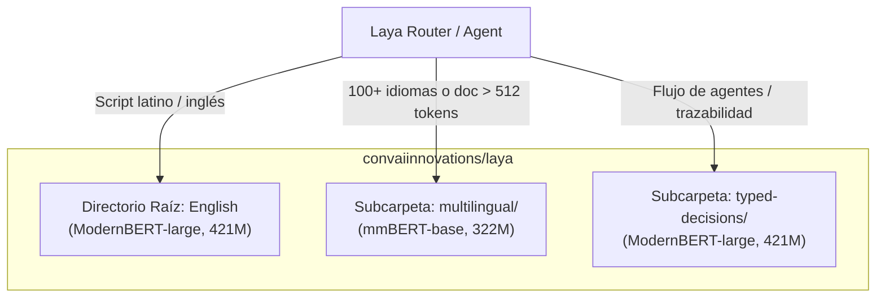
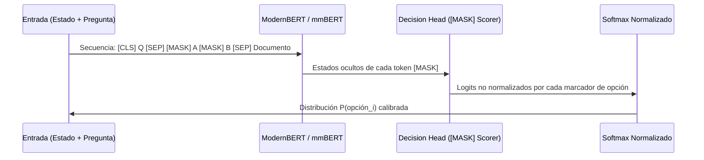

# Arquitectura Profunda y Checkpoints de Laya

> Análisis detallado de los fundamentos de red neuronal, backbones (`ModernBERT-large` y `mmBERT-base`), mecanismo de marcadores de opción `[MASK]`, asignación de presupuestos de tokens y entrenamiento RLCD.

---

## 1. Familia de Checkpoints Oficiales

El repositorio principal [`convaiinnovations/laya`](https://huggingface.co/convaiinnovations/laya) en Hugging Face actúa como el hub central para tres variantes especializadas:

| Checkpoint | Backbone Encoder | Parámetros Totales | Contexto Máximo | Peso en Disco | Propósito Principal |
| :--- | :--- | :--- | :--- | :--- | :--- |
| **`laya`** (English) | `ModernBERT-large` | 421M | 512 tokens | ~808 MB (`.safetensors`) | Inferencia de ultra-alta velocidad en idioma inglés. |
| **`laya-multilingual`** | `mmBERT-base` | 322M | 1,024 (hasta 8,192 con RoPE) | ~647 MB (`.safetensors`) | Cobertura en 100+ idiomas; 2x más rápido en batching. |
| **`laya-typed-decisions`** | `ModernBERT-large` | 421M | 1,024 tokens | ~808 MB (`.safetensors`) | Ajustado para flujos de agentes (soporte, finanzas, seguridad). |

---

## 2. Anatomía de la Red Neuronal

Cada checkpoint de Laya no es un simple modelo de clasificación con una capa lineal fija (`Linear(D, num_classes)`), ya que eso exigiría conocer las etiquetas durante el entrenamiento. En su lugar, utiliza un **Mecanismo Dinámico de Marcadores de Opción**:

1. **Backbone Bidireccional**:
   - Para inglés: `ModernBERT-large` (395M parámetros) completamente ajustado (*fully fine-tuned*). Aprovecha Flash Attention 2, Rotary Position Embeddings (RoPE) y un vocabulario extendido y optimizado.
   - Para multilingüe: `mmBERT-base` (22 capas, vocabulario masivo de 256,000 subwords, 322M parámetros).
2. **Decision Head Especializado (26M parámetros adicionales)**:
   - 2 capas Transformer adicionales entrenadas desde cero.
   - Un clasificador de marcadores de opción (*Option-Marker Scorer*).
   - Una cabeza de acción y escalamiento (*Act/Escalate Head*).

---

## 3. El Mecanismo de Marcadores `[MASK]`

A diferencia de los clasificadores clásicos donde las clases están fijadas en el código, Laya permite definir las preguntas y sus opciones **en tiempo de ejecución**.

### Formato Interno de la Secuencia Tokenizada

Cuando se invoca `predict(state, questions)`, el compilador interno de Laya ensambla la siguiente secuencia:

$$\text{[CLS]} \quad \langle\text{Pregunta} + \text{Instrucciones}\rangle \quad \text{[SEP]} \quad \text{[MASK] } \text{opt}_1 \quad \text{[MASK] } \text{opt}_2 \quad \dots \quad \text{[MASK] } \text{opt}_N \quad \text{[SEP]} \quad \langle\text{Estado / Documento}\rangle$$

- Cada opción candidata está precedida por su propio token especial `[MASK]`.
- La atención bidireccional permite que el encoder examine todo el documento a la luz de las opciones y viceversa.
- El *Decision Head* extrae la representación oculta exclusivamente de los tokens `[MASK]`, calcula un logit por opción y aplica un `softmax` restringido al subconjunto de opciones de esa pregunta.
- **Resultado**: Puedes inventar etiquetas o categorías arbitrarias en tu código Python sin necesidad de reentrenar la red.

---

## 4. Presupuesto de Tokens (`head_max_len` vs `max_len`)

La longitud total de la secuencia (`max_len`) se reparte de forma estricta entre dos áreas:

1. **`head_max_len` (Presupuesto de Opciones)**: Espacio reservado para las instrucciones de la pregunta, descripciones de criterios y marcadores `[MASK]`.
2. **Presupuesto del Estado (`max_len - head_max_len`)**: Espacio restante asignado al documento o payload analizado.

### Distribución de Fábrica

| Checkpoint | `max_len` por defecto | `head_max_len` por defecto | Espacio restante para el Estado |
| :--- | :--- | :--- | :--- |
| `laya` (English) | 512 tokens | 192 tokens | ~320 tokens |
| `laya-multilingual` | 1,024 tokens | 256 tokens | ~768 tokens (hasta 7,936 si `max_len=8192`) |
| `laya-typed-decisions` | 1,024 tokens | 256 tokens | ~768 tokens |

### Fórmula de Asignación por Opción
Cuando una pregunta tiene $N$ opciones, el número de tokens permitidos por cada opción se calcula como:

$$\text{tokens\_por\_opción} = \max\left(4, \left\lfloor\frac{\text{head\_max\_len} - 16}{N}\right\rfloor\right)$$

*(donde 16 es el margen de seguridad para las instrucciones).*

> [!WARNING] **El Colapso de Opciones Múltiples (High-Cardinality)**
> Si intentas evaluar una pregunta con 77 opciones (ej. dataset Banking77) en el modelo en inglés con `head_max_len = 192`:
> $$\text{tokens\_por\_opción} = \max(4, (192 - 16) // 77) = 4 \text{ tokens}$$
> Cada opción recibe solo el `[MASK]` y 3 subpalabras, lo que destruye el significado de las etiquetas largas y derrumba la exactitud de 0.87 a 0.42. 
> **Solución**: Aumentar `agent.cfg["head_max_len"] = 512` y `agent.cfg["max_len"] = 1024` o estructurar en dos niveles jerárquicos (ver [`10-tips-comunidad-antipatrones-y-limites-honestos.md`](file:///home/bypabloc/projects/bypabloc/laya/docs/research/10-tips-comunidad-antipatrones-y-limites-honestos.md)).

---

## 5. Entrenamiento RLCD (Reinforcement Learning for Calibrated Decisions)

A diferencia de los modelos supervisados estándar entrenados puramente con Cross-Entropy (que tienden a ser sobreconfiados y calibrar deficientemente las probabilidades), Laya fue entrenado mediante **Aprendizaje por Refuerzo con Reglas de Puntuación Estrictamente Propias**:

1. **Política Estocástica**: El modelo emite una distribución sobre las opciones. Durante la exploración se añade ruido Gaussiano de media cero a los logits.
2. **Recompensa con Strictly Proper Scoring Rules**:
   - **Logarithmic Score**: Penaliza fuertemente predicciones con baja probabilidad en la clase verdadera.
   - **Spherical Score**: Recompensa la estabilidad geométrica de la distribución de confianza.
   - **Ranked Probability Score (RPS)**: Utilizado específicamente en preguntas ordinales (`score`), castigando más si el modelo confunde una urgencia 0 con una 2 que si la confunde con una 1.
3. **Optimización con REINFORCE + Baseline tipo GRPO**:
   - Se utiliza una línea base media de grupo (*group-mean baseline* similar a DeepSeekMath/GRPO), eliminando la necesidad de un modelo crítico separado.
   - Para diálogos y secuencias de múltiples turnos, se aplica $TD(\lambda=1.0)$ sobre prefijos acumulados.

> [!NOTE] **La Propiedad Matemática Fundamental**
> Una regla de puntuación estrictamente propia garantiza que el valor esperado de la recompensa se maximiza **única y exclusivamente cuando el modelo reporta sus verdaderas probabilidades Bayesianas**. Reportar probabilidades infladas o arbitrarias reduce la recompensa esperada.
