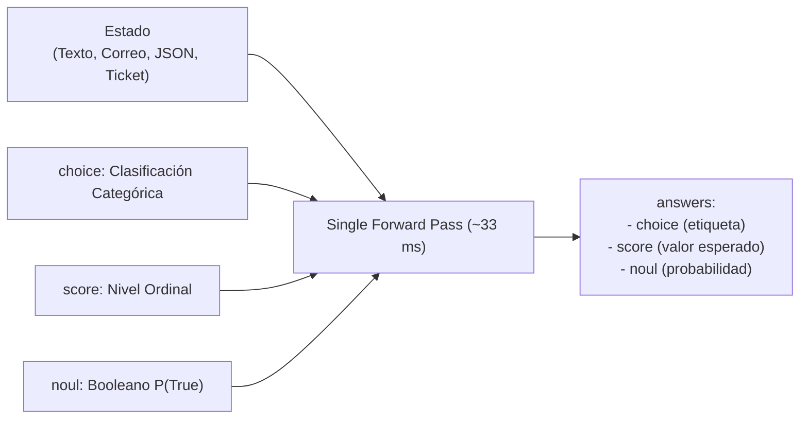

# Guía de Uso y Primitivas Tipadas en Laya

> Guía exhaustiva de instalación, configuración de aceleradores de hardware, especificación de preguntas tipadas (`choice`, `score`, `noul`), esquemas Pydantic y estructura de respuestas.

---

## 1. Instalación y Requisitos de Entorno

Laya requiere **Python 3.10 o superior** (debido a las dependencias base de `torch >= 2.14`, `transformers >= 5.x` y `huggingface_hub >= 1.x`).

### 1.1. Instalación Estándar

```bash
# Con pip estándar
python -m pip install laya

# Con uv (recomendado)
uv add laya
# o en entorno virtual activo:
uv pip install laya
```

### 1.2. Paquetes Extra Disponibles

| Extra | Comando | Propósito |
| :--- | :--- | :--- |
| `serve` | `pip install "laya[serve]"` | Servidor HTTP REST FastAPI compatible con TypeSafe Jev (`laya-serve`). |
| `mcp` | `pip install "laya[mcp]"` | Servidor Model Context Protocol (`laya-mcp-server`) sobre stdio. |
| `structured` | `pip install "laya[structured]"` | Soporte directo para validación de esquemas con Pydantic. |
| `langchain` | `pip install "laya[langchain]"` | Integración con nodos de decisión en LangChain y LangGraph. |
| `llamaindex` | `pip install "laya[llamaindex]"` | Selectores y enrutadores para pipelines de LlamaIndex. |
| `crewai` | `pip install "laya[crewai]"` | Agentes de enrutamiento y orquestación para CrewAI. |
| `onnx` | `pip install "laya[onnx]"` | Runtime acelerado ONNX con soporte de cuantización INT8. |
| `fast` | `pip install "laya[fast]"` | Fast-path en GPU NVIDIA utilizando kernels TileLang. |

### 1.3. Selección de Dispositivo y Aceleración de Hardware

Laya detecta automáticamente el hardware disponible en el orden: **CUDA → MPS (Apple Silicon) → XPU (Intel) → CPU**.

```python
import laya

# 1. Dejar que Laya seleccione el mejor acelerador
agent = laya.load("convaiinnovations/laya")

# 2. Forzar un dispositivo específico
agent_cuda = laya.load("convaiinnovations/laya", device="cuda:0")
agent_mps = laya.load("convaiinnovations/laya", device="mps")
agent_cpu = laya.load("convaiinnovations/laya", device="cpu")
```

---

## 2. Las Tres Primitivas Tipadas Fundamentales

Una llamada a Laya toma un **Estado** (`str`, `dict` o `list`) y un diccionario de **Preguntas**, evaluándolas todas en un único *forward pass*.



### 2.1. Primitiva `choice`: Selección Categórica Discreta

Selecciona una opción entre $N$ alternativas. Cada opción debe incluir descripciones semánticas claras en `criteria` para maximizar la precisión del encoder.

```python
questions = {
    "support_tier": {
        "type": "choice",
        "instructions": "Which technical team should resolve this issue?",
        "criteria": {
            "l1_support": "password resets, basic navigation, generic queries",
            "db_admins": "database deadlocks, slow queries, corruption",
            "security": "unauthorized logins, data leak alerts, CVE reports",
            "devops": "Kubernetes pod crashes, CI/CD pipeline failures"
        }
    }
}
```

**Respuesta devuelta:**
```python
result["answers"]["support_tier"]
# {
#   "type": "choice",
#   "choice": "db_admins",
#   "probabilities": {
#       "l1_support": 0.021,
#       "db_admins": 0.892,
#       "security": 0.015,
#       "devops": 0.072
#   },
#   "confidence": 0.814,        # Concentración de entropía normalizada
#   "answer_confidence": 0.892  # max(P) -> EL VALOR PARA HACER GATING
# }
```

### 2.2. Primitiva `score`: Clasificación Ordinal Ponderada

Evalúa una propiedad en una escala jerárquica u ordinal ordenada (ej. niveles de urgencia o severidad de 0 a $K-1$).

```python
questions = {
    "urgency": {
        "type": "score",
        "instructions": "How urgent is this incident?",
        "criteria": [
            "low (can wait days)",
            "medium (needs resolution today)",
            "high (system impaired)",
            "critical (total outage, data loss)"
        ]
    }
}
```

**Respuesta devuelta:**
```python
result["answers"]["urgency"]
# {
#   "type": "score",
#   "score": 2.78,             # Valor esperado continuo en el rango [0.0, 3.0]
#   "probabilities": [0.01, 0.04, 0.12, 0.83],
#   "confidence": 0.795,
#   "answer_confidence": 0.830
# }
```

### 2.3. Primitiva `noul`: Verificación Booleana Probabilística

Responde a una proposición cerrada de tipo Sí/No, retornando la probabilidad de que la afirmación sea verdadera ($P(\text{true}) \in [0.0, 1.0]$).

```python
questions = {
    "is_cancellation_threat": {
        "type": "noul",
        "instructions": "Does the user explicitly state they will cancel the service?"
    },
    "demands_refund": {
        "type": "noul",
        "instructions": "Does the user demand a monetary refund?"
    }
}
```

**Respuesta devuelta:**
```python
result["answers"]["is_cancellation_threat"]
# {
#   "type": "noul",
#   "noul": 0.941,             # Probabilidad P(true)
#   "confidence": 0.882,
#   "answer_confidence": 0.941
# }
```

---

## 3. Esquemas Tipados con Pydantic (`decide`)

Cuando se instala `laya[structured]`, es posible pasar directamente clases de `pydantic.BaseModel` al método `decide()`, eliminando la necesidad de armar diccionarios manuales de preguntas:

```python
from typing import Literal
from pydantic import BaseModel
import laya

class TicketClassification(BaseModel):
    category: Literal["billing", "technical", "sales", "legal"]
    priority_level: Literal[0, 1, 2, 3]
    requires_immediate_escalation: bool

agent = laya.load("convaiinnovations/laya")

state = "Our database crashed and transactions are failing worldwide!"
decision = agent.decide(state, schema=TicketClassification)

print(decision)
# TicketClassification(
#     category='technical',
#     priority_level=3,
#     requires_immediate_escalation=True
# )
```

---

## 4. `confidence` vs `answer_confidence`: La Distinción Crítica

Uno de los errores más comunes en la comunidad es confundir los dos campos de confianza que devuelve Laya:

1. **`confidence`**: Es una medida de la concentración de la distribución calculada como $1 - \text{Entropía Normalizada}$. Indica cuán "puntiaguda" es la distribución general sobre todas las opciones, pero **no** equivale a la probabilidad de la opción ganadora.
2. **`answer_confidence`**: Es exactamente la probabilidad calibrada asignada a la respuesta seleccionada ($\max(P)$).

> [!IMPORTANT] **Regla Operativa para Umbrales (Gating)**
> En cualquier flujo de producción donde se defina un umbral (`if conf >= 0.85: auto_action()`), **SIEMPRE debes verificar `answer_confidence`**, nunca `confidence`.
