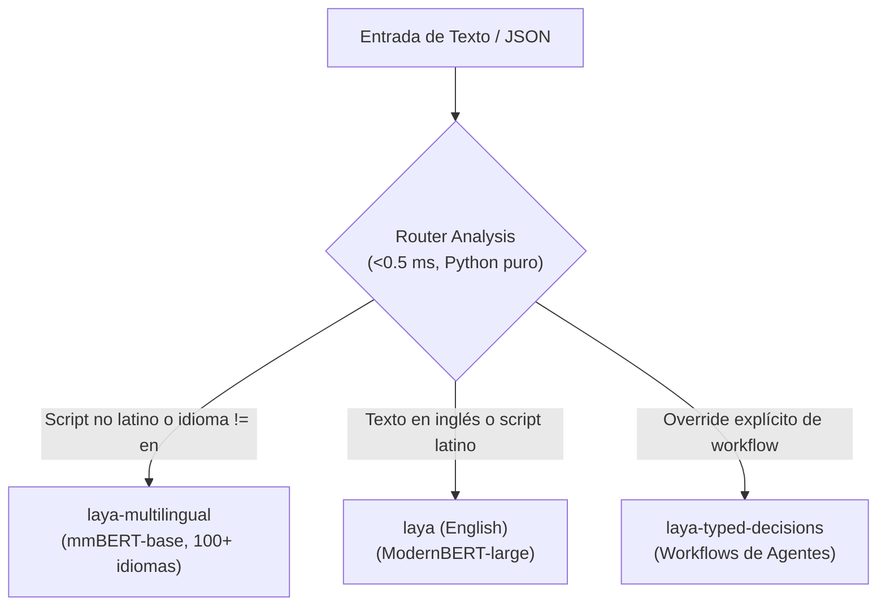

# El Router y Soporte Multilingüe en Laya

> Funcionamiento del componente `Router`, detección de idiomas en microsegundos (<0.5 ms), gestión de memoria VRAM/RAM, prevención de colapsos fuera de distribución y soporte de documentos largos (hasta 8,192 tokens).

---

## 1. Por Qué el Router es Indispensable

El checkpoint base en inglés (`convaiinnovations/laya`) fue entrenado sobre `ModernBERT-large`. Cuando este modelo recibe texto en alfabetos no latinos (árabe, cirílico, devanagari, tailandés, jemer), sufre un **colapso catastrófico fuera de distribución**.

En los benchmarks oficiales de Laya:
- Al evaluar texto en alfabeto Jemer (*Khmer*), el modelo en inglés arrojó **0.000 de exactitud**, pero con una **confianza del 95.2%**.
- Debido a que el modelo permanece sobreconfiado incluso estando 100% equivocado, los filtros por umbral de confianza (*confidence gating*) son incapaces de proteger el sistema.

El componente `Router` resuelve esto ejecutando un análisis de script y heurística lingüística en **Python puro en <0.5 ms** antes de tocar cualquier red neuronal, enviando automáticamente el texto al checkpoint correcto.



---

## 2. Uso Básico y Metadatos de Enrutamiento

```python
from laya import Router

router = Router()

questions = {
    "intent": {
        "type": "choice",
        "instructions": "Classify the user intent",
        "criteria": {
            "billing": "charges, invoices, refunds",
            "support": "technical issues, errors, bugs"
        }
    }
}

# Texto en español
res_es = router.predict("No puedo acceder a mi cuenta, me da error 500.", questions)
print(res_es["routing"])
# {
#   "model": "multilingual",
#   "repo": "convaiinnovations/laya/multilingual",
#   "reason": "Latin script but language detected as 'es', not English"
# }

# Texto en hindi
res_hi = router.predict("मुझे अपना पासवर्ड रीसेट करना है।", questions)
print(res_hi["routing"])
# {
#   "model": "multilingual",
#   "repo": "convaiinnovations/laya/multilingual",
#   "reason": "non-Latin script (devanagari, 100% of letters); the English checkpoint cannot read it"
# }
```

---

## 3. Gestión de Memoria y Precarga en Producción

### 3.1. Precarga Completa (`preload=True`)
Por defecto, `Router()` es perezoso (*lazy*): solo descarga e inicializa un checkpoint cuando llega una petición que lo requiere. En un entorno de producción, la primera llamada sufriría una latencia de inicialización (segundos).

Para servidores y APIs productivas, precarga los modelos en memoria al arrancar:

```python
# Precarga todos los checkpoints en GPU
router = Router(preload=True, device="cuda")

# O precarga únicamente los modelos que realmente atiendes
router = Router(preload=True, device="cuda", models=["english", "multilingual"])
```

### 3.2. Políticas de Retención de Memoria (`max_loaded`)

| Configuración | Comportamiento | Impacto en Latencia | Caso de Uso |
| :--- | :--- | :--- | :--- |
| `max_loaded=2` *(Default)* | Mantiene calientes `english` y `multilingual` con política LRU. | Microsegundos al alternar entre inglés y otros idiomas. | Servidores de producción estándar. |
| `max_loaded=1` | Solo mantiene un checkpoint en memoria. Al cambiar de idioma, descarga el anterior y carga el nuevo. | **~7.4 s de recarga en CPU / ~10.3 s en GPU T4** por cada cambio. | Entornos de desarrollo locales con VRAM muy reducida (<2 GB). |
| `max_loaded=3` | Mantiene calientes los tres checkpoints simultáneamente. | Cero latencia en cualquier cambio. | Servidores dedicados con al menos 4 GB de VRAM libre. |

Liberación manual de memoria:
```python
router.unload()  # Vacía los pesos de la GPU/RAM inmediatamente
```

---

## 4. Inyección de Detectores de Idioma Personalizados (`lang_guess` y `lang`)

Si tu arquitectura ya cuenta con un modelo de identificación de idiomas de alto rendimiento (ej. FastText o CLD3), puedes inyectarlo directamente para ahorrar cómputo y evitar falsos positivos en textos extremadamente cortos:

```python
# 1. Sugerencia suave (soft hint): Nudge al router, pero permite fallback
res = router.predict(state, questions, lang_guess="es")

# 2. Inyección de un callable personalizado a nivel de instancia
def custom_language_detector(text: str) -> str | None:
    # Lógica de detección con modelo propietario
    return "pt" if "obrigado" in text.lower() else None

router = Router(lang_guess=custom_language_detector)

# 3. Forzado estricto (bypasa completamente cualquier detección)
res = router.predict(state, questions, lang="de")
```

---

## 5. Manejo de Documentos Largos (Hasta 8,192 Tokens)

El checkpoint `laya-multilingual` cuenta con Rotary Position Embeddings (RoPE), permitiendo procesar hasta **8,192 tokens** de contexto (frente a los 512 tokens del modelo en inglés). 

Sin embargo, para proteger el consumo de memoria por defecto, el runtime aplica un límite inicial de 1,024 tokens. Si trabajas con contratos, transcripciones o correos extensos, debes pasar explícitamente `max_len=8192` y forzar el modelo `multilingual`:

```python
with open("legal_contract_20_pages.txt") as f:
    long_document = f.read()

questions = {
    "governing_law": {
        "type": "choice",
        "instructions": "Which jurisdiction governs this agreement?",
        "criteria": {
            "chile": "laws of the Republic of Chile",
            "mexico": "laws of Mexico",
            "delaware": "State of Delaware, USA",
            "other": "any other territory"
        }
    }
}

# Es obligatorio fijar model="multilingual" si el documento está en inglés pero supera 512 tokens
result = router.predict(
    long_document,
    questions,
    model="multilingual",
    max_len=8192
)

print(result["answers"]["governing_law"]["choice"])
```

### Comportamiento de Rendimiento en Contexto Largo:
- El tiempo de ejecución escala con la longitud **real** del documento, no con el límite `max_len`. Un texto de 200 palabras tarda los mismos ~33 ms aunque se declare `max_len=8192`.
- Para un documento de ~4,000 tokens, la inferencia tarda aproximadamente **1.7 segundos en un Apple Silicon GPU (MPS)** o ~1.2 s en una GPU NVIDIA RTX.
