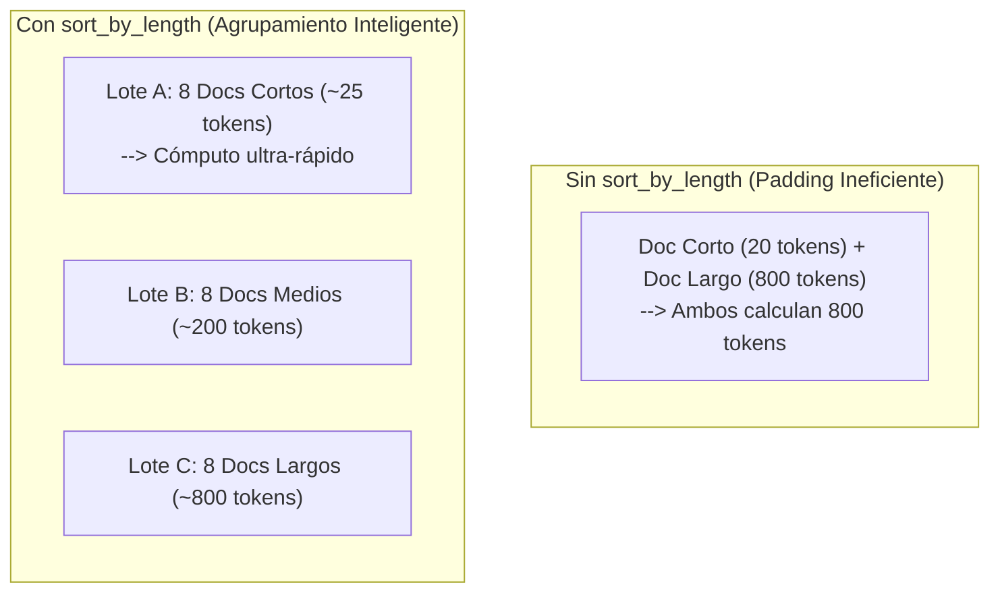

# Optimización de Rendimiento, Batching y Compilación

> Estrategias avanzadas de rendimiento: paralelismo por lotes (*batching*), ordenamiento por longitud (`sort_by_length`), aceleración con ONNX Runtime INT8, fast-path con TileLang y consideraciones sobre `torch.compile`.

---

## 1. Batching de Alto Rendimiento y `sort_by_length`

Cuando se procesan cientos o miles de tickets, registros o documentos, procesarlos uno a uno en un bucle secuencial es ineficiente. Laya proporciona `predict_batch()` y `decide_batch()`.

### El Problema del Padding y la Solución con `sort_by_length`

En un *forward pass* por lotes en redes Transformer, todas las secuencias del lote deben rellenarse con tokens `[PAD]` hasta igualar la longitud del elemento más largo del lote. Si un correo de 2 líneas comparte lote con un informe de 1,500 palabras, el correo corto desperdicia más del 90% de sus FLOPS computando atención sobre tokens de relleno.

El parámetro `sort_by_length=True` reordena internamente las peticiones agrupando estados de longitud similar en los mismos sub-lotes y restaura las respuestas al orden de entrada original de forma transparente.



### Código de Implementación

```python
from laya import Router

router = Router(preload=True, device="cuda")

# Lista de 100 peticiones heterogéneas
requests = [
    {"state": "Short text here", "questions": my_questions},
    {"state": "Another very long document ... [3000 chars]", "questions": my_questions},
    # ...
]

# Inferencia agrupada por tamaño de texto
results = router.predict_batch(
    requests,
    batch_size=8,
    sort_by_length=True
)
```

### Ganancia de Rendimiento Medida

- **Apple Silicon (M-series / MPS)**: Reducción de latencia de 41.2 s a 29.2 s (**1.42x más rápido**).
- **Servidor HTTP con carga concurrente**: De 5.35 s a 3.04 s (**1.77x más rápido**).
- **Dataset sintético de 10,000 tickets**: Aceleración comprobada de **2.15x**.

---

## 2. Inferencia en CPU con ONNX Runtime (`laya[onnx]`)

En despliegues donde no se dispone de GPU dedicada (ej. microservicios en Kubernetes con nodos CPU), PyTorch estándar puede tener una sobrecarga significativa. La exportación a ONNX con cuantización **INT8** reduce la huella de memoria y multiplica la velocidad.

### 2.1. Exportación y Cuantización

```bash
pip install "laya[onnx]"

# Exportar modelo a ONNX cuantizado a INT8
python scripts/export_onnx.py \
  --checkpoint ./models/laya \
  --output ./models/laya-onnx \
  --quantize
```

> [!IMPORTANT] **Cuantización Per-Tensor vs Per-Channel**
> En versiones recientes de Laya, la cuantización por defecto es **per-tensor**. La cuantización previa *per-channel* colapsaba la calibración del modelo de decisión, cayendo al 32% de concordancia con PyTorch eager. La cuantización *per-tensor* preserva más del 98.5% de fidelidad con los pesos originales en FP32/BF16.

### 2.2. Uso de `ONNXAgent`

```python
from laya.onnx_agent import ONNXAgent

# Carga directa del motor ONNX optimizado
agent = ONNXAgent("./models/laya-onnx/model_quantized.onnx")

result = agent.predict(
    "Cancel subscription now",
    {"churn": {"type": "noul", "instructions": "Is the user leaving?"}}
)
```

---

## 3. Fast Path con TileLang (`laya[fast]`)

Para GPUs NVIDIA modernas (Ampere, Ada Lovelace, Hopper), Laya implementa kernels fusionados desarrollados con **TileLang**.
- Fusión de buffers QKV directamente en memoria compartida (SRAM).
- Eliminación completa de buffers intermedios de máscara de atención.
- Invocación:
```python
agent = laya.load("convaiinnovations/laya", device="cuda", fast=True)
```

---

## 4. Peligros de `torch.compile(compile=True)` y Cómo Evitarlos

PyTorch 2.x permite compilar modelos mediante `torch.compile`. Sin embargo, en arquitecturas ModernBERT existen particularidades críticas de asignación de memoria:

1. **Materialización del Buffer de Atención**: En modo interpretado (*eager*), PyTorch SDPA maneja la máscara de atención `(batch, 1, seq_len, seq_len)` como una vista de broadcast virtual (sin memoria física).
2. **El Problema con Inductor**: Bajo dimensiones dinámicas en `compile=True`, el backend Inductor no siempre puede probar la alineación y expande la máscara a un búfer real en memoria de `batch x heads x seq_len x seq_len`.
3. **Consumo de VRAM**: Para un lote de 32 secuencias de 1,024 tokens en BF16 con 12 cabezas de atención, esa matriz ocupa **0.8 GB de VRAM extra**.
4. **Recomendación**: Si utilizas `compile=True`, acota siempre el tamaño de lote con `batch_size=8` o `batch_size=16` para evitar saturación de memoria GPU y trashing en el allocador de CUDA.

---

## 5. Resumen de Benchmarks de Rendimiento

Pruebas ejecutadas sobre hardware estándar (NVIDIA Tesla T4 16GB, documento representativo de 250 tokens):

| Métrica | Laya (English) | Laya (Multilingual) | TypeSafe Jev (Propietario) | LLM 8B (vLLM FP8) |
| :--- | :--- | :--- | :--- | :--- |
| **Latencia P50 (1 pregunta)** | 39.5 ms | **32.8 ms** | 236 - 276 ms | 450 - 1,200 ms |
| **Latencia P50 (10 preguntas)**| 158.6 ms | **72.3 ms** | N/A (secuencial) | 800 - 2,500 ms |
| **Throughput (Preguntas/seg)** | 103 - 180 q/s | **210 - 332 q/s** | ~20 - 35 q/s | ~15 - 40 q/s |
| **Consumo VRAM en Inferencia** | ~1.2 GB | **~0.9 GB** | API Cloud | 8 - 16 GB |
