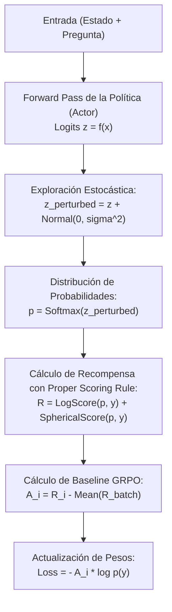

# Guía de Fine-Tuning y Calibración con RLCD

> Metodología para entrenar y calibrar Laya sobre datos de dominio propio. Cómo pasar del ~36% al ~77% de exactitud utilizando hardware accesible (Kaggle gratuito con 2x T4 o Apple Silicon MPS local).

---

## 1. Por Qué el Fine-Tuning es Determinante

Los checkpoints públicos de Laya son modelos fundacionales entrenados sobre corpus generales. En tareas de dominio específico (clasificación de tickets de telecomunicaciones, incidentes de seguridad bancaria, categorización de errores en trazas de observabilidad):

- **Modelo base (Zero-Shot)**: Exactitud de ~0.362 (comparable al azar de 0.318).
- **Modelo afinado con RLCD (`laya-typed-decisions`)**: Exactitud de **0.766** en el mismo conjunto de 2,000 decisiones, superando al profesor humano (0.735) y al modelo comercial cerrado TypeSafe Jev (0.727).

---

## 2. Requisitos de Hardware y Recursos

El proceso no requiere clusters industriales de H100. Puede ejecutarse completamente en:
- **Kaggle**: 2x GPUs NVIDIA Tesla T4 (16 GB cada una, 100% gratuito en cuota semanal).
- **Apple Silicon**: Mac con chip M1/M2/M3/M4 Pro/Max (mediante backend `mps`).
- **GPU de consumo local**: NVIDIA RTX 3060/4070 (12 GB VRAM o superior).

---

## 3. Preparación del Dataset de Entrenamiento

El dataset para RLCD consiste en tuplas de `(estado, preguntas, etiquetas_reales)`. Se formatea típicamente en JSONL:

```json
{
  "state": "Recibí un cobro no reconocido de $45.000 en mi tarjeta de crédito terminada en 4411.",
  "questions": {
    "categoria": {
      "type": "choice",
      "instructions": "Clasificar la categoría del reclamo",
      "criteria": {
        "fraude": "cargos no reconocidos, clonación",
        "facturacion": "cobros duplicados, suscripciones",
        "otro": "consultas no financieras"
      }
    },
    "urgente": {
      "type": "noul",
      "instructions": "¿Requiere bloqueo inmediato?"
    }
  },
  "targets": {
    "categoria": "fraude",
    "urgente": 1.0
  }
}
```

---

## 4. El Bucle de Entrenamiento RLCD Paso a Paso

El algoritmo **RLCD (Reinforcement Learning for Calibrated Decisions)** implementa:



### 4.1. Código Esencial del Bucle RLCD

```python
import torch
import torch.nn.functional as F
from laya.common import proper_reward

def rlcd_training_step(model, optimizer, batch, noise_std=0.1):
    optimizer.zero_grad()
    
    # 1. Obtener logits de la cabeza de decisión
    outputs = model(batch["input_ids"], attention_mask=batch["attention_mask"])
    logits = outputs.decision_logits  # [batch_size, num_options]
    
    # 2. Exploración con ruido Gaussiano
    noise = torch.randn_like(logits) * noise_std
    perturbed_logits = logits + noise
    probs = F.softmax(perturbed_logits, dim=-1)
    
    # 3. Evaluar recompensa estrictamente propia (Proper Scoring Rule)
    # Recompensa alta solo si probs[target] es alto y calibrado
    rewards = proper_reward(probs, batch["targets"])  # [batch_size]
    
    # 4. Baseline medio tipo GRPO
    advantages = rewards - rewards.mean()
    
    # 5. Gradiente de política REINFORCE
    log_probs = F.log_softmax(logits, dim=-1)
    selected_log_probs = log_probs.gather(1, batch["targets"].unsqueeze(1)).squeeze(1)
    
    loss = -(selected_log_probs * advantages).mean()
    loss.backward()
    optimizer.step()
    
    return loss.item(), rewards.mean().item()
```

---

## 5. Calibración de Temperaturas Post-Entrenamiento

Una vez finalizado el entrenamiento de los pesos, se ajusta un vector de temperaturas escalares sobre el conjunto de validación para minimizar el Error de Calibración Esperado (ECE):

$$P_{\text{calibrado}}(y_i) = \text{Softmax}\left(\frac{z_i}{T_{k}}\right)$$

Donde cada $T_k$ se optimiza mediante regresión isotónica o descenso de gradiente para cada combinación de `(tipo_de_pregunta, cantidad_de_opciones)`.

Las temperaturas calculadas se guardan automáticamente en el archivo `rl_agent_config.json`:

```json
{
  "temperatures_by_options": {
    "choice_2": 1.12,
    "choice_3": 1.25,
    "choice_4": 1.38,
    "choice_5": 1.45,
    "noul": 1.18,
    "score_3": 1.05
  }
}
```

---

## 6. Recursos Oficiales de Fine-Tuning

- **Notebook oficial para Kaggle 2xT4**: [`laya_finetune_typed_decisions_2xT4_kaggle.ipynb`](https://github.com/NandhaKishorM/laya/blob/main/notebooks/laya_finetune_typed_decisions_2xT4_kaggle.ipynb).
- **Script para Apple Silicon (MPS)**: [`laya_finetune_typed_decisions_mps.py`](https://github.com/NandhaKishorM/laya/blob/main/notebooks/laya_finetune_typed_decisions_mps.py).
- **Suite de Evaluación**: `laya-evals run --calibration` para certificar que el modelo entrenado no sufre regresiones antes del despliegue a producción.
