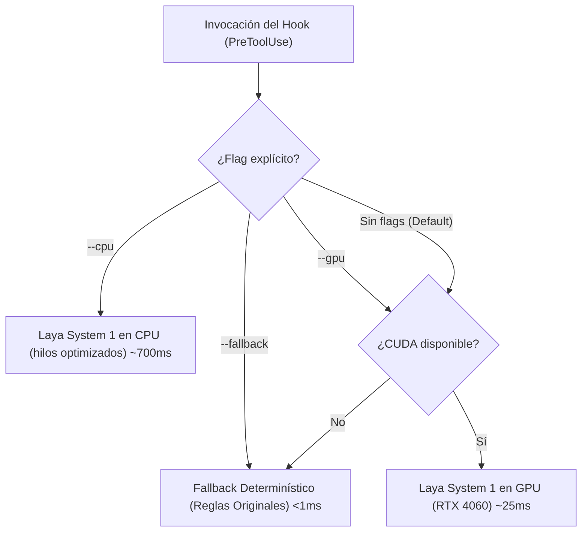

# Hooks de Seguridad Claude Code potenciados por Laya System 1

Este directorio contiene los reemplazos modulares basados en **Laya System 1** y reglas determinísticas para los 4 hooks de seguridad de Claude Code (`.claude/hooks/`), estructurados siguiendo principios **KISS**, **SOLID** y **DRY**.

---

## 📂 Arquitectura de Archivos y Responsabilidades

| Archivo | Responsabilidad / Hook Reemplazado | Fallback Determinístico | Investigación Relacionada |
| :--- | :--- | :--- | :--- |
| [`src/common.py`](common.py) | **Núcleo Compartido**: Singleton de Router Laya, normalización de rutas, auto-aprobación de temporales, formateo de variables de entorno y emisión de eventos PreToolUse (`allow`, `ask`, exit 2). | N/A (Módulo Base) | [04-el-router-y-multilingue.md](../docs/research/laya/04-el-router-y-multilingue.md)<br>[07-optimizacion-y-rendimiento.md](../docs/research/laya/07-optimizacion-y-rendimiento.md)<br>[10-tips-comunidad-antipatrones-y-limites-honestos.md](../docs/research/laya/10-tips-comunidad-antipatrones-y-limites-honestos.md) |
| [`src/block_dangerous.py`](block_dangerous.py) | **Comandos Peligrosos**: Auto-aprobación incondicional de temporales (`./tmp/**`, `/tmp/claude-*`, build artifacts, git-ignored), bloqueo de comandos catastróficos y evaluación semántica Laya de riesgos. | Patrones regex catastróficos + verificación de temporales | [08-casos-de-uso-y-patrones-arquitecturales.md](../docs/research/laya/08-casos-de-uso-y-patrones-arquitecturales.md)<br>[03-guia-de-uso-y-primitivas.md](../docs/research/laya/03-guia-de-uso-y-primitivas.md) |
| [`src/block_env_read.py`](block_env_read.py) | **Protección `.env`**: Bloqueo de lectura directa (`cat`, `head`, `awk`, herramienta `Read`), autorización de `source .env` e inferencia de tipos de credenciales sin mostrar valores. | Bloqueo sintáctico de comandos de lectura sobre `.env` | [08-casos-de-uso-y-patrones-arquitecturales.md](../docs/research/laya/08-casos-de-uso-y-patrones-arquitecturales.md)<br>[09-recetario-de-ejemplos-practicos.md](../docs/research/laya/09-recetario-de-ejemplos-practicos.md) |
| [`src/detect_secrets.py`](detect_secrets.py) | **Detección de Secretos**: Intercepta `Edit` y `Write`. Combina firmas (OpenAI, AWS, GitHub, claves privadas) con clasificación semántica Laya de tokens (JWT, contraseñas). Filtra placeholders (`REPLACE_ME`, `os.environ`). | Firmas regex de credenciales | [03-guia-de-uso-y-primitivas.md](../docs/research/laya/03-guia-de-uso-y-primitivas.md)<br>[10-tips-comunidad-antipatrones-y-limites-honestos.md](../docs/research/laya/10-tips-comunidad-antipatrones-y-limites-honestos.md) |
| [`src/protect_files.py`](protect_files.py) | **Archivos Protegidos**: Bloqueo de lockfiles (`uv.lock`, `package-lock.json`), `.git/`, `.venv/` y `.env`. Confirmación requerida (`ask`) en `.claude/settings.json` y hooks. Permite plantillas (`.env.example`). | Patrones de rutas críticas y plantillas | [08-casos-de-uso-y-patrones-arquitecturales.md](../docs/research/laya/08-casos-de-uso-y-patrones-arquitecturales.md)<br>[06-despliegue-produccion-y-servidores.md](../docs/research/laya/06-despliegue-produccion-y-servidores.md) |
| [`src/test_hooks.py`](test_hooks.py) | **Suite de Pruebas**: 32 pruebas exhaustivas en memoria (<800ms) o subprocesos cubriendo todos los casos en GPU, CPU y Fallback. | Ejecución completa en 4 ms | [07-optimizacion-y-rendimiento.md](../docs/research/laya/07-optimizacion-y-rendimiento.md)<br>[09-recetario-de-ejemplos-practicos.md](../docs/research/laya/09-recetario-de-ejemplos-practicos.md) |

---

## ⚡ Autodetección de Hardware y Modos de Ejecución

Todos los scripts implementan autodetección y degradación elegante:



---

## 🧪 Ejemplos de Ejecución y Pruebas

### 1. Suite de Pruebas (32 casos)

```bash
# Ejecutar suite con autodetección en GPU (P50: ~25ms, total <800ms)
.venv/bin/python src/test_hooks.py --gpu

# Ejecutar suite forzando CPU
.venv/bin/python src/test_hooks.py --cpu

# Ejecutar suite en modo fallback (reglas determinísticas de scripts originales sin IA, <5ms)
.venv/bin/python src/test_hooks.py --fallback

# Ejecutar filtrando por hook específico
.venv/bin/python src/test_hooks.py --gpu --hook dangerous
.venv/bin/python src/test_hooks.py --gpu --hook env
.venv/bin/python src/test_hooks.py --gpu --hook secrets
.venv/bin/python src/test_hooks.py --gpu --hook protect
```

### 2. Ejemplos de Invocación Directa (CLI)

```bash
# Auto-aprobación incondicional de temporales
echo '{"tool_name": "Bash", "tool_input": {"command": "rm -f ./tmp/cache.log"}}' | .venv/bin/python src/block_dangerous.py

# Bloqueo de lectura de .env con inferencia de formatos
echo '{"tool_name": "Bash", "tool_input": {"command": "cat .env"}}' | .venv/bin/python src/block_env_read.py

# Detección semántica de tokens JWT
echo '{"tool_name": "Edit", "tool_input": {"new_string": "JWT = \"eyJhbGci...\""}}' | .venv/bin/python src/detect_secrets.py

# Bloqueo de modificación de lockfiles
echo '{"tool_name": "Edit", "tool_input": {"file_path": "package-lock.json"}}' | .venv/bin/python src/protect_files.py
```
